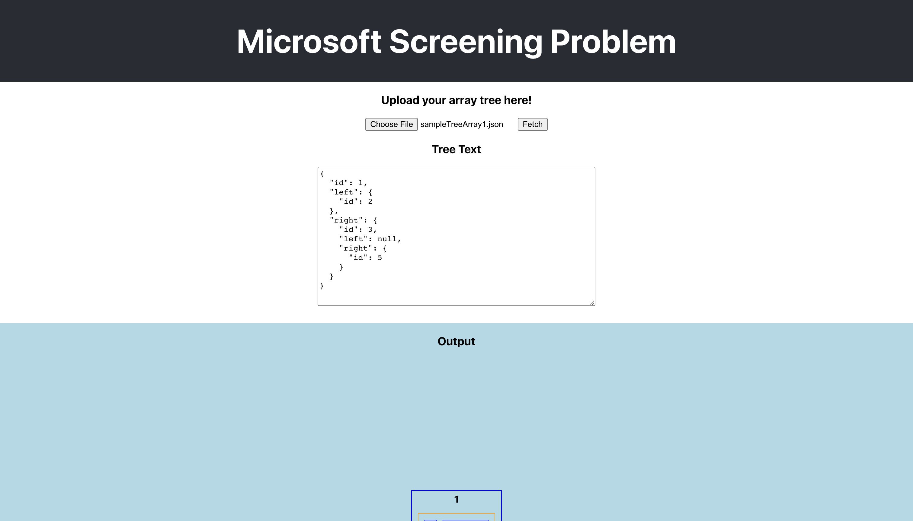
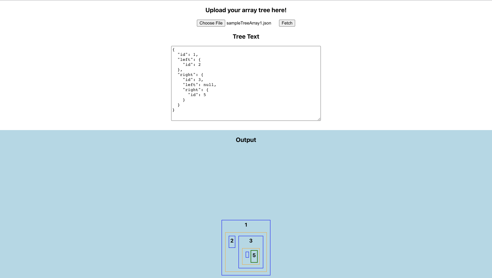
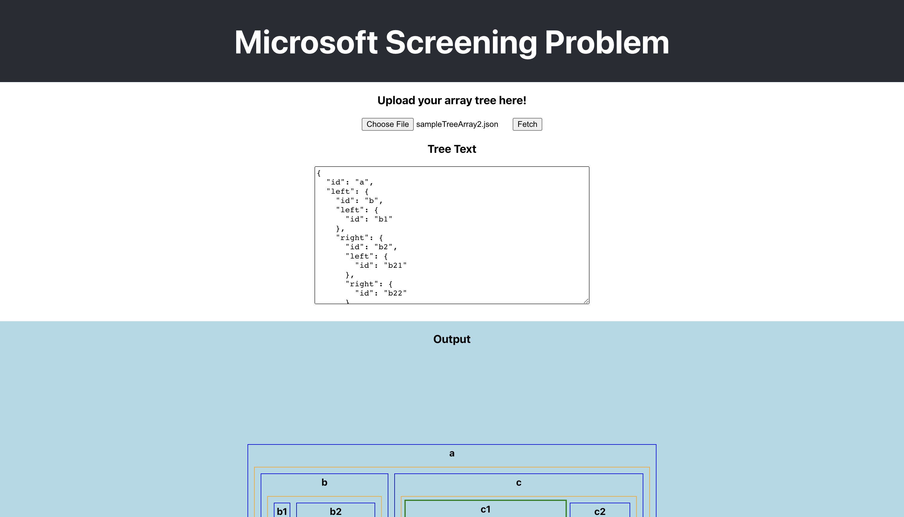
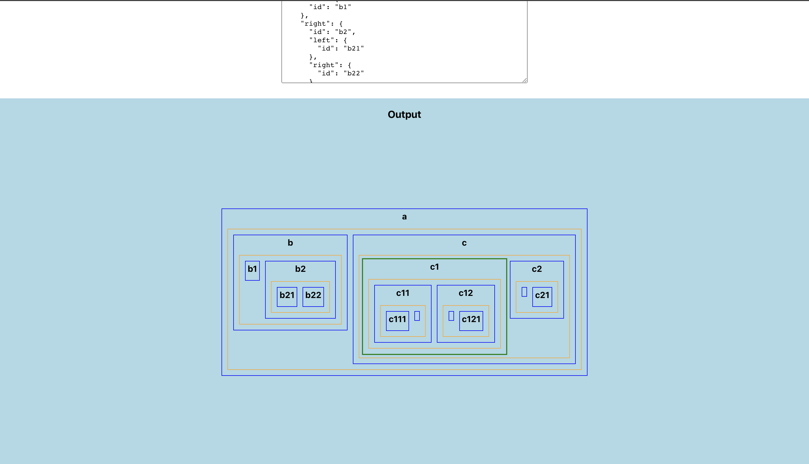
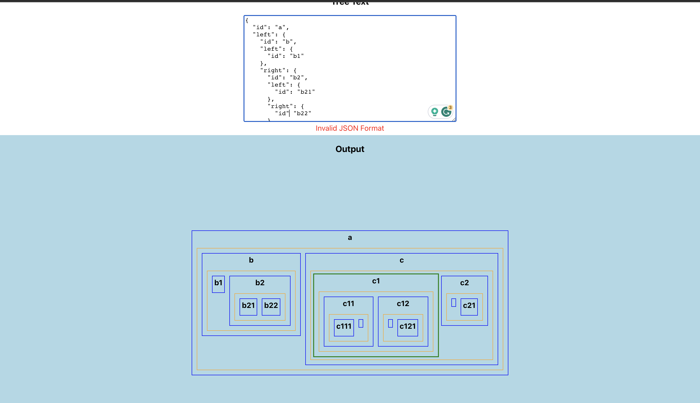
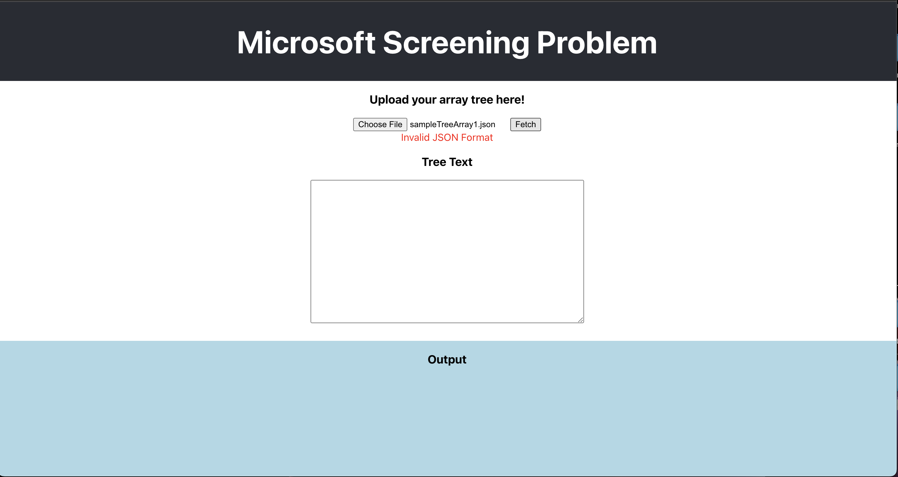

# Microsoft Screening Problem

## Tech Stack
- React, Javascript, CSS, Jest, and Redux

## How to run?
- Go inside the microsoft-test folder
- Run the command `npm i` to install dependencies
- Run the command `npm start`

## How to run unit tests?
- Run the command `npm test`

## Where is my Problem 1 file?
- `microsoft-test/src/microsoft-p1.js`
- If you would like to test problem-1 separately I have set up a different folder where you can execute problem 1 with node.js
- Go to the `node` directory
- Run the command `node microsoft-p1-node` to run your test cases.
- Lines 31-37 in the file `microsoft-p1-node.js` execute my tests. You can go ahead and comment them out or replace them.

## How to run problems 2 and 3
- Open terminal
- Go to the directory `microsoft-test`
- Run the command `npm start`
- From here you should be able to view the project locally

### Work Flow
- Click on Choose File
- You will only be allowed to input a .json or .txt file
- Click on Fetch
- The uploaded file data will be parsed and displayed in the text box
- If the file contains invalid JSON then an error message will appear
- Scroll down to view the visual output
- The node that has a green box is the smallest subtree with all the deepest nodes
- Orange boxes are a node's children
- Blue boxes represent a whole tree/subtree
- You can edit the text box, and see live changes to the visual output
- No live changes will occur if the JSON is invalid

## Problem 3 solution

### Assumptions I made
- Each node in the binary tree has an id property and left and right properties representing
its left and right child nodes.
- The id property in each node is unique within the binary tree.
- The goal is to find the smallest subtree that contains all the deepest nodes. If multiple nodes whose depths are equal to the max tree depth, then the solution is the smallest subtree containing all those deepest nodes.

### Engineering Tradeoffs
- Recursive approach: The solution provided uses a recursive approach to traverse the tree and find the depth of each node. This approach is intuitive and easy to implement, but it may have limitations in handling very large trees, as it relies on the call stack.
- The time complexity of my solution is dependent on the size of the binary tree. It needs to traverse the entire tree. In the worst-case scenario, where the binary tree is skewed, the time complexity would be O(n), where n is the number of nodes in the tree.
- Output Structure: The solution returns the smallest subtree that contains all the deepest nodes. It includes the complete subtree structure from the root down to the deepest nodes. However, if multiple subtrees satisfy the condition, the solution may return any one of those subtrees.

### Algorithm
- The FirstDepth function is a helper function that finds the depth of a given node in a binary tree
- The findSmallestSubtree helper function finds the smallest subtree containing all the deepest nodes. It takes two parameters: the current node being processed and the depth of the current node. 
- If the current node is null, meaning it has no child nodes, the function returns null.
- If the depth is 1, meaning we have reached the maximum depth of the tree, the function returns the current node.
- Next, calculate the depth of the left and right subtrees of the current node using the findDepth function.
- If the left and right subtrees have equal depths and both depths are equal to depth - 1, it means that the current node is part of the smallest subtree containing all the deepest nodes. So return the current node.
- If the depth of the left subtree is greater than or equal to the depth of the right subtree, the function recursively calls itself on the left subtree with depth - 1.
- Otherwise, if the depth of the right subtree is greater than the depth of the left subtree, the function recursively calls itself on the right subtree with depth - 1.
- Run the findDepth function to find the maximum depth of the tree. Use the result to run the function findSmallestSubtree to find the smallest subtree with all the deepest nodes.

## Bonus

 ### What would I have done differently?
 - In my project, I used Redux for state management. If I had the time I would have learned how to use the React hook useContext, and try to use that for state management instead. It may have been better to use a built-in React feature rather than importing a library.

 - I would have tried to not use recursion in this project. I used it in files like SmallestSubTree.js because it made the solution a lot easier. But the downside is scalability. If we have a very large binary tree then the call stack may overflow.

- I would have liked to keep everything on a single page, and not make my application scrollable. I ended up making the output section larger because I wanted the output to be easy to read. If I had the extra time I would have spent more time trying to get everything to fit on a single page, but still look nice, and be very readable.

- I did create some unit tests, but I would have liked to add more, and test every React component.

### Fun extras I added
- Users are limited to uploading .json and .txt files
- A .json file and .txt file won't be uploaded if it contains invalid JSON
- I added unit tests with jest. Look inside the `microsoft-test/src/Tests`

## Screenshots

- Small input file

